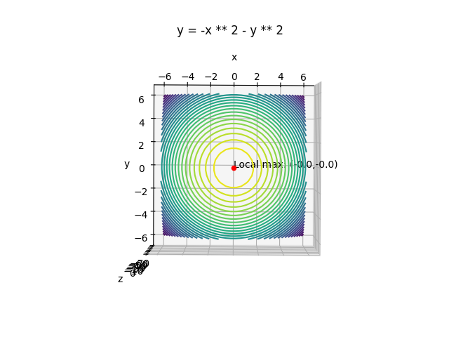
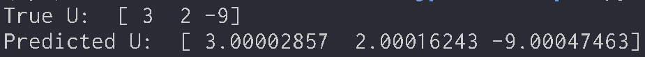

# Optimization
This repository implements optimization calculations for multivariate functions and statistical optimization.

## Related articles I wrote
- [Implementation of Simplex Method](https://medium.com/@hirok4/implementation-of-simplex-method-c8d40f647fe5)
- [Implementing Class Classification by Unsupervised Learning](https://medium.com/@hirok4/implementing-class-classification-by-unsupervised-learning-e1b71cdabc42)
- [Python Implementation of Levenberg–Marquardt Algorithm](https://medium.com/@hirok4/python-implementation-of-levenberg-marquardt-algorithm-8ff8abdec0f5)
- [Python Implementation of Gauss Newton Method](https://medium.com/@hirok4/python-implementation-of-gauss-newton-method-2892307a2c65)
- [Python Implementation of Newton’s Method](https://medium.com/@hirok4/python-implementation-of-newtons-method-9db1e863cf3c)
- [Python Implementation of Gradient Method](https://medium.com/@hirok4/python-implementation-of-gradient-method-e6575c082e1f)

<br></br>

## Gradient method(1 variable case)
The function $f(x)$ can be computed numerically as follows, knowing that there is only one x with $f\prime(x)=0$ in the domain under consideration.
First, a point $x_0$, which is considered to be close to the maximum value, is given as an initial value. If $f\prime(x)=0$, take the maximum value there. If $f\prime(x)=0$ is positive, go right on the x-axis. If $f\prime(x)=0$ is negative, go left on the x-axis.

### Algorighm
#### 1. Give the initial value of $x$, let $h \leftarrow h_0$

#### 2. Define as follows

$$
h=sgn(f\prime(x))\lVert h \rVert, X\leftarrow x, X\prime \leftarrow x+h
$$

$sgn$ is the sign function. This is defined as $sgn(x)=1$ if $x>0$, $sgn(x)=0$ if $x=0$, and $sgn(x)=-1$ if $x<0$.

#### 3. If $f(X) < f (X\prime)$, do the following calculations
- Repeat following calculation until $f(X)\geqq f(X\prime)$

$$
h\leftarrow2h, X\leftarrow X\prime, X\prime \leftarrow X+h
$$

- Update following variables

$$
x\leftarrow X, h\leftarrow h/2
$$

#### 4. If not $f(X) < f (X\prime)$, do the following calculations

- Repeat following calculation until $f(X)\leqq f(X\prime)$

$$
h\leftarrow h/2, X\prime \leftarrow X\prime-h
$$

- Update following variables

$$
x\leftarrow X\prime, h\leftarrow 2h
$$

#### 5. Go back to step2 and repeat them until $\lVert f\prime(x) \rVert \leqq \epsilon$

#### 6. Return the resulting x

You can try gradient method by runngin below command. In this example, we want to find the maximum value of $y=-x^2$.

```bash
python3 gradient_method.py
```


<br></br>

## Gradient method(Multivariable case)
The gradient method for finding the maximum value of the bivariate function $f(x,y)$ is as follows. First, a point $(x_0,y_0)$ that is considered to be close to the point of maximum value is given as an initial value. Since the direction in which the function value increases the most is given by the gradient $\triangledown f$, we proceed to the point where the function value reaches its maximum on a straight line in that direction. At that point, the gradient $\triangledown f$ is calculated again, and the same process is repeated. This is done until convergence is reached.

### Algorithm
#### 1. Give initial value of $x$

#### 2. Linear search with $F\prime$ for function $F(t)=f(x+t\triangledown f(x))$
Putting $x(t)=x_0+t\triangledown f_0$, differentiating $F(t)=f(x(t))$ with $t$ yields

$$
\frac{dF}{dt}=\sum_{i=1}^n\frac{\partial f}{\partial x_i} \frac{dx_i}{dt}=(\triangledown f, \triangledown f_0)
$$

#### 3. Let $\triangle x \leftarrow t\triangledown f(x),x \leftarrow x+\triangle x$ using $t$ obtained in step 2

#### 4. Go back to step2 and repeat this loop until $\|\triangle x\|<\delta$

#### 5. Return x

At a point determined by a gradient method linear search for the function $f(x_1,...,x_n)$, the isosurface of $f(x_1,...,x_n)$ passing through that point is tangent to the search line. Therefore, the direction of the next linear search is orthogonal to the previous search direction.

You can try gradient method in the multivariable case by runngin below command. In this example, we want to find the maximum value of $z=-x^2-y^2$.

```bash
python3 hill_climbing.py
```




<br></br>

## Newton's method(1 variable case)
If you can compute not only the first-order derivative $f\prime(x)$ but also the second-order derivative $f\prime\prime(x)$, there is a more efficient method than the gradient method. The value of the function $f(x)$ at a point $\bar{x}+\triangle x$ near point $\bar{x}$ on the x axis is Taylor expanded and written as follows.

$$
f(\bar{x}+\triangle x)=f(\bar{x})+f\prime(\bar{x})\triangle x+\frac{1}{2}f\prime\prime(\bar{x})\triangle x^2+... \tag{1}
$$

The terms above the third order of $\triangle x$ rapidly decrease as $\triangle x$ is small. Ignoring this, consider the value that maximizes or minimizes the quadratic expression of $\triangle x$. Differentiating by $\triangle x$ and setting it to 0 yields

$$
f\prime(\bar{x})+f\prime\prime(\bar{x})\triangle x=0 \tag{2}
$$

Since this solution is $\triangle x=-f\prime(\bar{x})/f\prime\prime(\bar{x})$, a better approximation of the solution $x$ is given by

$$
x=\bar{x}-\frac{f\prime(\bar{x})}{f\prime\prime(\bar{x})} \tag{3}
$$

This iterative method is called the Newton's method. The algorithm is as follows.

### Algorithm
#### **1. Give initial value of $x$**

#### **2. Let $\bar{x}$ be $x$, and update $x$ as follows**

$$
x\leftarrow \bar{x}-\frac{f\prime(\bar{x})}{f\prime\prime(\bar{x})}
$$

#### **3. Go back to step2 and repeat this until $\|\ x-\bar{x} \|<\delta$**

#### **4. Retrun $x$**

<br></br>

The geometric meaning of Newton's method is as follows. The higher order terms in Eq(1) ... is to approximate the function $f(x)$ by the following parabola

$$
f_2(x)=f(\bar{x})+f\prime(\bar{x})(x-\bar{x})+\frac{1}{2}f\prime\prime(\bar{x})(x-\bar{x})^2 \tag{4}
$$

The above equation is called the second-order approximation of the function $f(x)$ at $x$. Eq(2) corresponds to computing, instead of the function $f(x)$, the $x$ that gives the extreme value of the parabola that is a second-order approximation of it.


You can try Newton's method by runngin below command. In this example, we want to find the minimum value of $y=x^3-2x^2+x+3$.

```bash
python3 newton.py
```


<br></br>

## Newton's method(Multivariable case)
The value of the function $f(x_1,...,x_n)$ at a point $(\bar{x_1}+\triangle x_1,...,\bar{x_n}+\triangle x_n)$ near point $(\bar{x_1},...,\bar{x_n})$ can be Taylor expanded and written as

$$
f(\bar{x_1},...,\bar{x_n})=\bar{f}+\sum_{i=1}^n \frac{\partial \bar{f}}{\partial x_i}\triangle x_i+\frac{1}{2}\sum_{i,j=1}^n \frac{\partial^2 \bar{f}}{\partial x_i \partial x_j}\triangle x_i\triangle x_j+... \tag{5}
$$

The bar represents the value at the point $(\bar{x_1},...,\bar{x_n})$. $...$ is a term of third order or higher with respect to $\triangle x_1,...,\triangle x_n$, and it decreases rapidly as $\triangle x_1,...,\triangle x_n$ is small. Therefore, we consider the quadratic expression for $\triangle x_1,...,\triangle x_n$ ignoring this term, which is partial differentiated by $\triangle x_i$ and set to 0, as follows.

$$
\frac{\partial \bar{f}}{\partial x_i}+\sum_{j=1}^n \frac{\partial^2 \bar{f}}{\partial x_i \partial x_j}\triangle x_j=0 \tag{6}
$$

Let $H$ denote the value of the Hesse matrix $\bar{H}$ at the point $(\bar{x_1},...,\bar{x_n})$.

$$
H=\begin{pmatrix}
\partial^2 f/\partial x_1^2 & ... & \partial^2 f/\partial x_1 \partial x_n \\
. & . & . \\
\partial^2 f/\partial x_n \partial x_1 & ... & \partial^2 f/\partial x_n^2
\end{pmatrix} \tag{7}
$$

Eq(6) can be rewritten as

$$
\bar{H}\triangle x=-\triangledown\bar{f} \tag{8}
$$

A better approximation of the solution $x$ is obtained as follows

$$
x=\bar{x}-\bar{H}^{-1}\triangledown\bar{f} \tag{9}
$$

### Algorithm
#### **1. Give initial value of $x$**

#### **2. Compute the value of the gradient $\triangledown f$ and the Hesse matrix $H$ at $x$**

#### **3. Update $x$ as follows**

$$
x \leftarrow x-H^{-1}\triangledown f
$$

#### **4. Go back to step2 and repeat this until $\|\ \triangle x \|<\delta$**

You can try multivariable Newton's method by running below command. In this example, we want to find the minimum value of $f=x^3+y^3-9xy+27$.

```bash
python3 newton_multi_var.py
```


<br></br>

## Gauss Newton method
Suppose that the following equation is theoretically known to hold for an m-dimensional vector $x_1,x_2,...,x_N$ if measurement error is not considered.

$$
F_l(x_\alpha,u)=0,\qquad l=1,2,...,r, \qquad \alpha=1,2,...,N \tag{1}
$$

$F_l(x_\alpha,u)$ is an arbitrary continuous function of the variable $x$. And $u$ is the sum of the common $n$ unknown parameters in the $r$ equations, written in the form of n-dimensional vectors.

However, when $x_1,x_2,...,x_N xn$ are measurement data, it is generally not possible to make all of the $r$ equations in Eq(1) hold true no matter what $u$ is chosen because each component contains a measurement error. In such a case, consider the problem of finding $u$ that makes all the equations approximately true, i.e., satisfies the equation below.

$$
F_l(x_\alpha,u)\approx0,\qquad l=1,2,...,r, \qquad \alpha=1,2,...,N \tag{2}
$$

A typical method for obtaining this is the nonlinear least-squares method, in which $u$ is determined so as to minimize the following equation.

$$
J=\frac{1}{2}\sum_{\alpha=1}^N\sum_{l=1}^r F_l(x_\alpha,u)^2 \tag{3}
$$

If each $F_l(x,u)$ is a linear expression of $u$, then $J$ is a quadratic expression of $u$. The partial differentiation of $J$ by each component $u_i$ of $u$ is a linear expression of $u$. Therefore, the solution can be determined by solving the simultaneous linear equations obtained by setting them to $0$. However, when $F_l(x,u)$ is a general function, the partial differentiation of $F_l(x,u)$ with $0$ is a complicated simultaneous nonlinear equation, and it is difficult to find a solution. For this reason, it is usual to minimize Eq(3) by numerical search such as Newton's method or conjugate gradient method.

In this case, whether the Newton's or conjugate gradient method is used, the Hesse matrix, whose elements are second-order derivatives, must be calculated. However, this is difficult when $F_l(x,u)$ is a complex function. However, if we focus on the form of Eq(2), the Hesse matrix of $J$ can be computed approximately without performing second-order differentiation.
Partial differentiation of Eq(3) with each component $u_i$ of $u$ yields

$$
\frac{\partial J}{\partial u_i}=\sum_{\alpha=1}^N\sum_{l=1}^r F_{l\alpha}\frac{\partial F_{l\alpha}}{\partial u_i} \tag{4}
$$

$F_l(x_\alpha, u)$ is abbreviated as $F_{l\alpha}$. Further partial differentiation with $u_j$ yields

$$
\frac{\partial^2 J}{\partial u_i \partial u_j}=\sum_{\alpha=1}^N\sum_{l=1}^r \left(\frac{\partial F_{l\alpha}}{\partial u_j} \frac{\partial F_{l\alpha}}{\partial u_i} + F_{l\alpha}\frac{\partial^2 F_{l\alpha}}{\partial u_i \partial u_j} \right) \tag{5}
$$

If $u$ is close to the solution, then from Eq(2), $F_{l\alpha}\approx0$. Therefore, the above equation can be approximated as follows.

$$
\frac{\partial^2 J}{\partial u_i \partial u_j}\approx\sum_{\alpha=1}^N\sum_{l=1}^r \frac{\partial F_{l\alpha}}{\partial u_j} \frac{\partial F_{l\alpha}}{\partial u_i} \tag{6}
$$

Eq(6) is called the Gauss-Newton approximation. If we denote by the symbol $\nabla u$ the vector whose components are the partial derivatives of each of $u_1, u_2,..., u_n$ From Eq(4) and (6), the gradient $\nabla J$ of the function $J$ and the Hesse matrix $H_u$ can be written as

$$
\nabla J=\sum_{\alpha=1}^N\sum_{l=1}^r F_{l\alpha}\nabla u F_{l\alpha}, \qquad H_u\approx\sum_{\alpha=1}^N\sum_{l=1}^r(\nabla u F_{l\alpha})(\nabla u F_{l\alpha})^\intercal \tag{7}
$$

The Newton method using the Hesse matrix approximated by the above equation is called the Gauss Newton method.
Applying Eq(7) to Newton's method, we obtain the following iterative formula.

$$
u^{(K+1)}=u^{(K)}-\left( \sum_{\alpha=1}^N\sum_{l=1}^r(\nabla u F_{l\alpha}^{(K)})(\nabla u F_{l\alpha}^{(K)})^\intercal \right)^{-1} \sum_{\beta=1}^N\sum_{m=1}^r F_{m\beta}^{(K)}\nabla u F_{m\beta}^{(K)} \tag{8}
$$

The symbol $(K)$ denotes that the value is the value assigned to the solution $u^{(K)}$ of the $K$ th iteration. This is done by starting with the appropriate initial value $u^{(0)}$, and then $k=0,1,2,...$ and iterate until convergence.

You can try Gauss Newton method by running below command. In this example, we want to find coefficients of a function($y = 3x^3 + 2y^2 - 9xy + 27$).

```bash
python3 gauss_newton.py
```


We can find approximate coefficients by gauss newton method.



<br></br>

## Levenberg–Marquardt algorithm
The Gauss Newton method does not require a second-order derivative, but this is an approximation that consists only of an approximation of the solution. If a good approximation of the solution is not available, it is advisable to first perform a coarse search, such as the gradient method, and then switch to the Gauss Newton method when the solution is somewhat closer. This is systematically done by the Levenberg-Marquardt method.
First, consider the case of minimization of one variable $J(u)$. The iterative formula for the Newton method is as follows.

$$
u^{(K+1)}=u^{(K)}-\frac{J\prime(u^{(K)})}{J\prime\prime(u^{(K)})} \tag{1}
$$

This approximates the function $J(u)$ by a quadratic equation in the neighborhood of the current value $u^{(K)}$ and moves to the position of its extreme value. However, when the current value $u^{(K)}$ is far from the extreme value of the function $J(u)$, applying Eq(1) as it is may cause the solution to pass far beyond the solution. As a result, it could go in the wrong direction from there. To prevent this, it is safe to proceed somewhat conservatively. Therefore, we change Eq(1) as follows.

$$
u^{(K+1)}=u^{(K)}-\frac{J\prime(u^{(K)})}{CJ\prime\prime(u^{(K)})} \tag{2}
$$

However, $C$ is a number greater than 1. This $C$ should be large when the current value $u^{(K)}$ is far from the solution, and should be close to 1 as it gets closer to the solution. Eq(2) can be written as follows in the case of n variables.

$$
\begin{align*}
\begin{pmatrix}
u_1^{(K+1)} \\
u_2^{(K+1)} \\
... \\
u_n^{(K+1)} \\
\end{pmatrix}
&=
\begin{pmatrix}
u_1^{(K)} \\
u_2^{(K)} \\
... \\
u_n^{(K)} \\
\end{pmatrix}-\frac{1}{C}
\begin{pmatrix}
(\partial J^{(K)}/\partial u_1)/(\partial^2 J^{(K)}/\partial u_1^2) \\
(\partial J^{(K)}/\partial u_2)/(\partial^2 J^{(K)}/\partial u_2^2) \\
... \\
(\partial J^{(K)}/\partial u_n)/(\partial^2 J^{(K)}/\partial u_n^2) \\
\end{pmatrix} \\
&=
\begin{pmatrix}
u_1^{(K)} \\
u_2^{(K)} \\
... \\
u_n^{(K)} \\
\end{pmatrix}-\frac{1}{C}
\begin{pmatrix}
\partial^2 J^{(K)}/\partial u_1^2 & 0 & ... & 0 \\
0 & \partial^2 J^{(K)}/\partial u_2^2 & ... & 0 \\
... & ... & ... & ... \\
0 & 0 & ... & \partial^2 J^{(K)}/\partial u_n^2 \\
\end{pmatrix}^{-1}
\begin{pmatrix}
\partial J^{(K)}/\partial u_1 \\
\partial J^{(K)}/\partial u_2 \\
... \\
\partial J^{(K)}/\partial u_n \\
\end{pmatrix} \tag{3}
\end{align*}
$$

Written in vector and matrix symbols, it looks like this

$$
u^{(K+1)}=u^{(K)}-\frac{1}{C}D[H_u^{(K)}]^{-1}\nabla_u J^{(K)} \tag{4}
$$

$D[⋅]$ denotes the creation of a diagonal matrix with only the diagonal components taken out. On the other hand, Newton's method for finding the extreme values of an n-variable function $J(u)$ can be written as follows.

$$
u^{(K+1)}=u^{(K)}-H_u^{(K)-1}\nabla_u J^{(K)} \tag{5}
$$

The idea of the Levenberg-Marquardt method is to use Eq(4) when the current value $u^{(K)}$ is far away from the solution and to use Eq(5) when it approaches the solution. Therefore, Eq(4) and Eq(5) are put together as follows.

$$
u^{(K+1)}=u^{(K)}-(H_u^{(K)}+cD[H_u^{(K)}])^{-1}\nabla_u J^{(K)} \tag{6}
$$

where $c=0$ is the Newton method of Eq(5). On the other hand, when $c$ is increased, it works practically the same as Eq(4). Therefore, $c$ is taken to be large when the current value $u^{(K)}$ is far away from the solution, and is taken to be small as it approaches the solution. In practice, it is unknown how far away the current value $u^{(K)}$ is from the solution, but empirically it is considered effective to adjust the constant $c$ using the following algorithmic procedure.

### Algorithm
#### **1. Initializa c to 0.0001**
#### **2. Give initial value of $u$**

#### **3. Calculate the sum of squares $J$ using $u$**

#### **4. Compute the gradient $\nabla_u J$ and the Hesse matrix $H_u$**

#### **5. Calculate $u\prime$**

$$
u\prime \leftarrow u-(H_u+cD[H_u])^{-1}\nabla_u J
$$

#### **6. Calculate $J\prime$ by using $u\prime$**

#### **7. If $J\prime>J$, update $c \leftarrow 10c$ and go back to step5**

#### **8. If not, update as follows**

$$
c \leftarrow \frac{c}{10}, \qquad J \leftarrow J\prime, \qquad u \leftarrow u\prime
$$


#### **9. Go back to step4 and repeat this until $\|\ \triangle u \|<\delta$**

You can try Levenberg–Marquardt algorithm by running below command. In this example, we want to find coefficients of a function($y = 3x^3 + 2y^2 - 9xy + 27$).

```bash
python3 levenberg_marquardt.py
```

<br></br>

# Data classification(Unsupervised learning)
Suppose we observe $N(=N_1+N_2)$ data $x_\alpha, \alpha=1,...,N$, where $N_1$ data independently generated from a normal distribution with mean $\mu_1$ and variance $\sigma_1^2$ and $N_2$ data independently generated from a normal distribution with mean $\mu_2$ and variance $\sigma_2^2$ are mixed. Each collection of data is called a class.
At this point, how can we determine which class each data belongs to? Suppose that $\mu_1,\sigma_1^2,\mu_2,\sigma_2^2,N_1,N_2$ are all unknown and only the total data $N=N_1+N_2$ is known.


Unsupervised learning considers each data $x_\alpha$ to belong with some probability across both classes. For example, $x_\alpha$ belongs to class $1$ with probability $1/3$ and class $2$ with probability $2/3$. The probability of belonging to each class is set as follows.

$$
w_\alpha^{(k)}=ProbabilityOfClassK, \quad \sum_{k=1,2}w_\alpha^{(k)}=1 \tag{1}
$$

This is estimated by iteration.

Given the affiliation probability $w_\alpha^{(k)}$, the number of data belonging to each class is also probabilistically determined. Its expected value is no longer necessarily an integer, but a real number as follows.

$$
N_k = \sum_{\alpha=1}^N w_\alpha^{(k)}, \qquad k=1,2 \tag{2}
$$

Since the expected number of data $x_\alpha$ included in class $k$ can be interpreted as $w_\alpha^{(k)}$, the mean and variance of the data included in class $k$ are estimated as follows.

$$
\mu_k = \frac{1}{N_k} \sum_{\alpha=1}^N w_\alpha^{(k)}x_\alpha, \qquad \sigma_k^2 = \frac{1}{N_k} \sum_{\alpha=1}^N w_\alpha^{(k)}(x_\alpha - \mu_k)^2, \qquad k=1,2 \tag{3}
$$

From these, the probability densities $p_1(x)$ and $p_2(x)$ can be estimated, and thus the probability density $p(x)$ of the mixed data can be estimated. The likelihood $p(x_\alpha)$ of $x_\alpha$ is the sum of the likelihoods $\frac{N_1}{N}p_1(x_\alpha)$ and $\frac{N_2}{N}p_2(x_\alpha)$ corresponding to each class.
Therefore, the probability of belonging to class $1$ and $2$ of this $x_\alpha$ is allocated proportionally in the ratio $\frac{N_1}{N}p_1(x_\alpha):\frac{N_2}{N}p_2(x_\alpha)$, respectively. The probability $w_\alpha^{(k)}$ of belonging to each class is as follows.

$$
w_\alpha^{(k)}=\frac{\pi_k p_k(x_\alpha)}{\sum_{l=1}^2 \pi_l p_l(x_\alpha)}, \qquad \pi_k=\frac{N_k}{N} \tag{4}
$$

The algorithm for classification into any $k$ classes is as follows.

## Algorithm

### 1. Initialize $w_\alpha^{(k)}$

### 2. Calculate $N_k, k=1,...,K$

$$
\mu_k = \frac{1}{N_k} \sum_{\alpha=1}^N w_\alpha^{(k)}x_\alpha, \qquad \sigma_k^2 = \frac{1}{N_k} \sum_{\alpha=1}^N w_\alpha^{(k)}(x_\alpha - \mu_k)^2
$$

### 3. Define $p_k(x), k=1,...,K$

$$
p_k(x) = \frac{1}{\sqrt{2\pi\sigma_k^2}}e^{-(x-\mu_k)^2/2\sigma_k^2}
$$

### 4. Update $w_\alpha^{(k)}$

$$
w_\alpha^{(k)}=\frac{\pi_k p_k(x_\alpha)}{\sum_{l=1}^l \pi_l p_l(x_\alpha)}, \qquad \pi_k=\frac{N_k}{N}
$$

### 5. If $w_\alpha^{(k)}$ is convergent, classify $x_\alpha$ into class $k$ where $w_\alpha^{(k)}$ is maximal. Otherwise, return to step 2.

You can try this unsurpervised learing algorithm by running below command.

```bash
python3 unsupervised_learning.py
```

The graph on the right side shows how unsupervised learning is used to classify classes.


<br></br>

# Linear programming
Consider an optimization problem of the following form

$$
\begin{cases}
a_{11}x_1+a_{12}x_2+...++a_{1n}x_n\leq b_1\\
a_{21}x_1+a_{22}x_2+...++a_{2n}x_n\leq b_2\\
...\\
a_{m1}x_1+a_{m2}x_2+...++a_{mn}x_n\leq b_m\\
\end{cases}\\
x_1\geq 0, \quad x_2\geq 0, \quad ..., \quad x_n\geq 0 \\
f=c_1x_1+c_2x_2+...+c_nx_n\rightarrow max \tag{1}
$$

This problem is characterized by the following points:
- The $n$ variables $x_1,...,x_n$ are all non-negative.
- The $m$ constraints are linear inequalities in the variable $x_1,...,x_n$.
- The function $f$ to be maximized is a linear inequality in variables $x_1,...,x_n$.

A problem with these three characteristics is called linear programming. And the representation of it as Eq(1) is called the standard form of linear programming. The method of solving a linear program is called linear programming. A concrete example of linear programming is the following problem.

```
Two machines M_1 and M_2 are used to make two different containers A and B. It takes 2 minutes to use machine M_1 and 4 minutes to use machine M_2 to make one container A. On the other hand, it takes 8 minutes for machine M_1 and 4 minutes for machine M_2 to make one container B. The profit from making containers A and B is 29 yen and 45 yen per container, respectively. How should we plan to maximize the profit?
```

If only $x$ and $y$ containers $A$ and $B$ are made per hour, respectively, the profit per hour is $29x + 45y$ yen. The total time spent using machine $M_1$ is $2x+8y$ minutes, and the total time spent using machine $M_2$ is $4x+4y$ minutes. Since this must be completed within one hour, the optimal production plan is the solution to the following linear programming problem.

$$
\begin{cases}
2x+8y\leq 60\\
4x+4y\leq 60\\
\end{cases}\\
x\geq 0, \quad y\geq 0 \\
f=29x+45y\rightarrow max \tag{2}
$$

## Slack variable
Inequalities can be equated by adding non-negative numbers to the smaller side. Eq(2) can be rewritten as

$$
\begin{cases}
2x+8y+\lambda_1 = 60\\
4x+4y+\lambda_2 = 60\\
\end{cases}\\
x\geq 0, \quad y\geq 0, \quad \lambda_1\geq 0, \quad \lambda_2\geq 0 \\
f=29x+45y\rightarrow max \tag{3}
$$

## Simplex method
If the variables $x,y$ and the slack variables $\lambda_1,\lambda_2$ are numbered consecutively as $x1,x2,x3,x4$, they can be written as follows.

$$
\begin{cases}
2x_1+8x_2+x_3 = 60\\
4x_1+4x_2+x_4 = 60\\
\end{cases}\\
x_1\geq 0, \quad x_2\geq 0, \quad x_3\geq 0, \quad x_4\geq 0 \\
f=29x_1+45x_2\rightarrow max \tag{4}
$$

$x_1,... ,x_4$, two of which are selected and transferred to the left side, and the right side is represented by the remaining variables. For example, if we choose $x_3,x_4$, we can write

$$
\begin{align*}
x_3&=60-2x_1-8x_2 \qquad (1) \\
x_4&=60-4x_1-4x_2 \qquad (2) \\
f&=29x_1+45x_2\qquad (3)
\end{align*} \tag{5}
$$

Putting all variables on the right side as $0$, we obtain the following solution.

$$
x_1=0, \quad x_2=0, \quad x_3=60, \quad x_4=60 \tag{6}
$$

These are all non-negative. However, this is not an optimal solution. This is because if we increase $x_1$ and $x_2$ slightly, $x_3$ and $x_4$ will remain positive, but the value of $f$ will increase. Therefore, we consider increasing $x_1$ or $x_2$ as large as possible as long as $x_3$ and $x_4$ are nonnegative.  
First, consider increasing $x_1$. $x_1$ can be increased up to a maximum of $x_1=15$. As a result, $f$ increases by $\triangle f=29\times 15=435$.

Next, consider increasing $x_2$. $x_2$ can be increased up to a maximum of $x_2=7.5$. As a result, $\triangle f=45\times 7.5=337.5$. As shown above, increasing $x_1$ will increase the value of $f$ more. Transform (2) in Eq(5) as follows

$$
x_1=15-x_2-\frac{1}{4}x_4 \tag{7}
$$

Substituting this into (1) and (3) in Eq. (5) and eliminating $x_1$, respectively, we obtain

$$
\begin{align*}
x_3&=30-6x_2+\frac{1}{2}x_4 \\
f&=435+16x_2-7.25x_4
\end{align*} \tag{8}
$$

In summary, the above is as follows

$$
\begin{align*}
x_3&=30-6x_2+\frac{1}{2}x_4 \qquad(4) \\
x_1&=15-x_2+\frac{1}{4}x_4 \qquad(5) \\
f&=435+16x_2-7.25x_4 \qquad(6) \\
\end{align*} \tag{9}
$$

Putting all variables on the right side as $0$, we obtain the following solution.

$$
x_2=0, \quad x_4=0 \quad x_3=30, \quad x_1=15 \tag{10}
$$

However, this is not the optimal solution. This is because even if $x_2$ is slightly increased in (4) and (5), $x_3$ and $x_1$ remain positive, but the value of $f$ is increased from (6). So we increase $x_2$. $x_2$ can be increased up to a maximum of $x_2=5$. Then $f$ increases by $\triangle f=16\times 5=80$, resulting in $x_3$ on the left side of (4) becoming $0$. Then, (4) is transformed as follows.

$$
x_2=5-\frac{1}{6}x_3+\frac{1}{12}x_4 \tag{11}
$$

Substituting this into (5) and (6) and eliminating $x_2$ yields

$$
\begin{align*}
x_2&=5-\frac{1}{6}x_3+\frac{1}{12}x_4 \qquad (7) \\
x_1&=10+\frac{1}{6}x_3-\frac{1}{3}x_4 \qquad (8) \\
f&=515-2.667x_3-5.917x_4 \qquad (9) \tag{12}
\end{align*}
$$

Putting all variables on the right side as $0$, we obtain the following solution.

$$
x_3=0, \quad x_4=0, \quad x_2=5, \quad x_1=10 \tag{13}
$$

This is the optimal solution. This is because the coefficients of $x_3$ and $x_4$ in (9) are negative, so if $x_3$ and $x_4$ are increased from $0$ even slightly, the value of $f$ will decrease. Therefore, the maximum value of $f$ is $f=515$.

You can try simplex method by running below command.

```bash
python3 simplex_method.py
```


<br></br>

## Reference
- [Optimization Mathematics That You Can Understand: From Fundamental Principles to Calculation Methods](https://www.amazon.co.jp/-/en/%E9%87%91%E8%B0%B7-%E5%81%A5%E4%B8%80/dp/4320017862/ref=sr_1_1?adgrpid=52832566945&hvadid=658804283256&hvdev=c&hvlocphy=9163303&hvnetw=g&hvqmt=e&hvrand=13823473628811259621&hvtargid=kwd-333784071069&hydadcr=27705_14678557&jp-ad-ap=0&keywords=%E3%81%93%E3%82%8C%E3%81%AA%E3%82%89%E5%88%86%E3%81%8B%E3%82%8B%E6%9C%80%E9%81%A9%E5%8C%96%E6%95%B0%E5%AD%A6&qid=1690020873&s=books&sr=1-1)
- [Gauss Newton method, Levenberg-Marquardt method in Python](https://daily-tech.hatenablog.com/entry/2017/03/21/063518)
