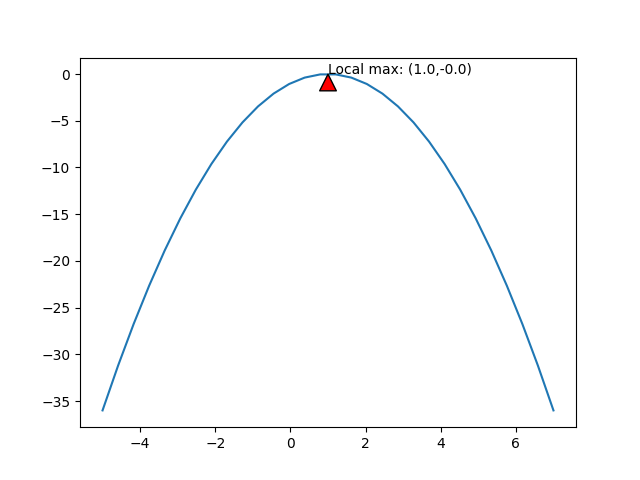
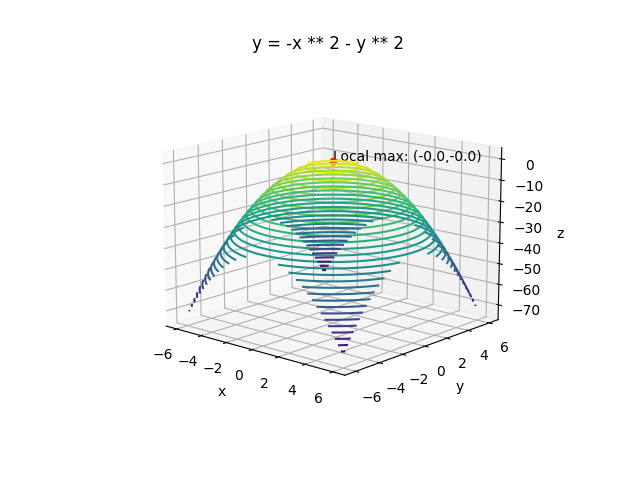

# Function optimization
This repository implements typical methods for computing optimization for multivariable functions. These are all iterative solution methods that search for a direction in which the function increases or decreases from a given initial position in the domain of the function, move in that direction, and repeat this until convergence.

<br></br>

## Gradient method(1 variable case)
The function $f(x)$ can be computed numerically as follows, knowing that there is only one x with $f\prime(x)=0$ in the domain under consideration.
First, a point $x_0$, which is considered to be close to the maximum value, is given as an initial value. If $f\prime(x)=0$, take the maximum value there. If $f\prime(x)=0$ is positive, go right on the x-axis. If $f\prime(x)=0$ is negative, go left on the x-axis.

### Algorighm
#### 1. Give the initial value of $x$, let $h \leftarrow h_0$

#### 2. Define as follows

$$
h=sgn(f\prime(x))\lVert h \rVert, X\leftarrow x, X\prime \leftarrow x+h
$$

$sgn$ is the sign function. This is defined as $sgn(x)=1$ if $x>0$, $sgn(x)=0$ if $x=0$, and $sgn(x)=-1$ if $x<0$.

#### 3. If $f(X) < f (X\prime)$, do the following calculations
- Repeat following calculation until $f(X)\geqq f(X\prime)$

$$
h\leftarrow2h, X\leftarrow X\prime, X\prime \leftarrow X+h
$$

- Update following variables

$$
x\leftarrow X, h\leftarrow h/2
$$

#### 4. If not $f(X) < f (X\prime)$, do the following calculations

- Repeat following calculation until $f(X)\leqq f(X\prime)$

$$
h\leftarrow h/2, X\prime \leftarrow X\prime-h
$$

- Update following variables

$$
x\leftarrow X\prime, h\leftarrow 2h
$$

#### 5. Go back to step2 and repeat them until $\lVert f\prime(x) \rVert \leqq \epsilon$

#### 6. Return the resulting x

You can try gradient method by runngin below command. In this example, we want to find the maximum value of $y=-x^2$.

```bash
python3 gradient_method.py
```



<br></br>

## Gradient method(Multivariable case)
The gradient method for finding the maximum value of the bivariate function $f(x,y)$ is as follows. First, a point $(x_0,y_0)$ that is considered to be close to the point of maximum value is given as an initial value. Since the direction in which the function value increases the most is given by the gradient $\triangledown f$, we proceed to the point where the function value reaches its maximum on a straight line in that direction. At that point, the gradient $\triangledown f$ is calculated again, and the same process is repeated. This is done until convergence is reached.

### Algorithm
#### 1. Give initial value of $x$

#### 2. Linear search with $F\prime$ for function $F(t)=f(x+t\triangledown f(x))$
Putting $x(t)=x_0+t\triangledown f_0$, differentiating $F(t)=f(x(t))$ with $t$ yields

$$
\frac{dF}{dt}=\sum_{i=1}^n\frac{\partial f}{\partial x_i} \frac{dx_i}{dt}=(\triangledown f, \triangledown f_0)
$$

#### 3. Let $\triangle x \leftarrow t\triangledown f(x),x \leftarrow x+\triangle x$ using $t$ obtained in step 2

#### 4. Go back to step2 and repeat this loop until $\|\triangle x\|<\delta$

#### 5. Return x

At a point determined by a gradient method linear search for the function $f(x_1,...,x_n)$, the isosurface of $f(x_1,...,x_n)$ passing through that point is tangent to the search line. Therefore, the direction of the next linear search is orthogonal to the previous search direction.

You can try gradient method in the multivariable case by runngin below command. In this example, we want to find the maximum value of $z=-x^2-y^2$.

```bash
python3 hill_climbing.py
```




<br></br>

## Newton's method(1 variable case)
If you can compute not only the first-order derivative $f\prime(x)$ but also the second-order derivative $f\prime\prime(x)$, there is a more efficient method than the gradient method. The value of the function $f(x)$ at a point $\bar{x}+\triangle x$ near point $\bar{x}$ on the x axis is Taylor expanded and written as follows.

$$
f(\bar{x}+\triangle x)=f(\bar{x})+f\prime(\bar{x})\triangle x+\frac{1}{2}f\prime\prime(\bar{x})\triangle x^2+... \tag{1}
$$

The terms above the third order of $\triangle x$ rapidly decrease as $\triangle x$ is small. Ignoring this, consider the value that maximizes or minimizes the quadratic expression of $\triangle x$. Differentiating by $\triangle x$ and setting it to 0 yields

$$
f\prime(\bar{x})+f\prime\prime(\bar{x})\triangle x=0 \tag{2}
$$

Since this solution is $\triangle x=-f\prime(\bar{x})/f\prime\prime(\bar{x})$, a better approximation of the solution $x$ is given by

$$
x=\bar{x}-\frac{f\prime(\bar{x})}{f\prime\prime(\bar{x})} \tag{3}
$$

This iterative method is called the Newton's method. The algorithm is as follows.

### Algorithm
#### **1. Give initial value of $x$**

#### **2. Let $\bar{x}$ be $x$, and update $x$ as follows**

$$
x\leftarrow \bar{x}-\frac{f\prime(\bar{x})}{f\prime\prime(\bar{x})}
$$

#### **3. Go back to step2 and repeat this until $\|\ x-\bar{x} \|<\delta$**

#### **4. Retrun $x$**

<br></br>

The geometric meaning of Newton's method is as follows. The higher order terms in Eq(1) ... is to approximate the function $f(x)$ by the following parabola

$$
f_2(x)=f(\bar{x})+f\prime(\bar{x})(x-\bar{x})+\frac{1}{2}f\prime\prime(\bar{x})(x-\bar{x})^2 \tag{4}
$$

The above equation is called the second-order approximation of the function $f(x)$ at $x$. Eq(2) corresponds to computing, instead of the function $f(x)$, the $x$ that gives the extreme value of the parabola that is a second-order approximation of it.


You can try Newton's method by runngin below command. In this example, we want to find the minimum value of $y=x^3-2x^2+x+3$.

```bash
python3 newton.py
```


<br></br>

## Newton's method(Multivariable case)
The value of the function $f(x_1,...,x_n)$ at a point $(\bar{x_1}+\triangle x_1,...,\bar{x_n}+\triangle x_n)$ near point $(\bar{x_1},...,\bar{x_n})$ can be Taylor expanded and written as

$$
f(\bar{x_1},...,\bar{x_n})=\bar{f}+\sum_{i=1}^n \frac{\partial \bar{f}}{\partial x_i}\triangle x_i+\frac{1}{2}\sum_{i,j=1}^n \frac{\partial^2 \bar{f}}{\partial x_i \partial x_j}\triangle x_i\triangle x_j+... \tag{5}
$$

The bar represents the value at the point $(\bar{x_1},...,\bar{x_n})$. $...$ is a term of third order or higher with respect to $\triangle x_1,...,\triangle x_n$, and it decreases rapidly as $\triangle x_1,...,\triangle x_n$ is small. Therefore, we consider the quadratic expression for $\triangle x_1,...,\triangle x_n$ ignoring this term, which is partial differentiated by $\triangle x_i$ and set to 0, as follows.

$$
\frac{\partial \bar{f}}{\partial x_i}+\sum_{j=1}^n \frac{\partial^2 \bar{f}}{\partial x_i \partial x_j}\triangle x_j=0 \tag{6}
$$

Let $H$ denote the value of the Hesse matrix $\bar{H}$ at the point $(\bar{x_1},...,\bar{x_n})$.

$$
H=\begin{pmatrix}
\partial^2 f/\partial x_1^2 & ... & \partial^2 f/\partial x_1 \partial x_n \\
. & . & . \\
\partial^2 f/\partial x_n \partial x_1 & ... & \partial^2 f/\partial x_n^2
\end{pmatrix} \tag{7}
$$

Eq(6) can be rewritten as

$$
\bar{H}\triangle x=-\triangledown\bar{f} \tag{8}
$$

A better approximation of the solution $x$ is obtained as follows

$$
x=\bar{x}-\bar{H}^{-1}\triangledown\bar{f} \tag{9}
$$

### Algorithm
#### **1. Give initial value of $x$**

#### **2. Compute the value of the gradient $\triangledown f$ and the Hesse matrix $H$ at $x$**

#### **3. Update $x$ as follows**

$$
x \leftarrow x-H^{-1}\triangledown f
$$

#### **4. Go back to step2 and repeat this until $\|\ \triangle x \|<\delta$**

You can try multivariable Newton's method by running below command. In this example, we want to find the minimum value of $f=x^3+y^3-9xy+27$.

```bash
python3 newton_multi_var.py
```


<br></br>

## Gauss Newton method
Suppose that the following equation is theoretically known to hold for an m-dimensional vector $x_1,x_2,...,x_N$ if measurement error is not considered.

$$
F_l(x_\alpha,u)=0,\qquad l=1,2,...,r, \qquad \alpha=1,2,...,N \tag{1}
$$

$F_l(x_\alpha,u)$ is an arbitrary continuous function of the variable $x$. And $u$ is the sum of the common $n$ unknown parameters in the $r$ equations, written in the form of n-dimensional vectors.

However, when $x_1,x_2,...,x_N xn$ are measurement data, it is generally not possible to make all of the $r$ equations in Eq(1) hold true no matter what $u$ is chosen because each component contains a measurement error. In such a case, consider the problem of finding $u$ that makes all the equations approximately true, i.e., satisfies the equation below.

$$
F_l(x_\alpha,u)\approx0,\qquad l=1,2,...,r, \qquad \alpha=1,2,...,N \tag{2}
$$

A typical method for obtaining this is the nonlinear least-squares method, in which $u$ is determined so as to minimize the following equation.

$$
J=\frac{1}{2}\sum_{\alpha=1}^N\sum_{l=1}^r F_l(x_\alpha,u)^2 \tag{3}
$$

If each $F_l(x,u)$ is a linear expression of $u$, then $J$ is a quadratic expression of $u$. The partial differentiation of $J$ by each component $u_i$ of $u$ is a linear expression of $u$. Therefore, the solution can be determined by solving the simultaneous linear equations obtained by setting them to $0$. However, when $F_l(x,u)$ is a general function, the partial differentiation of $F_l(x,u)$ with $0$ is a complicated simultaneous nonlinear equation, and it is difficult to find a solution. For this reason, it is usual to minimize Eq(3) by numerical search such as Newton's method or conjugate gradient method.

In this case, whether the Newton's or conjugate gradient method is used, the Hesse matrix, whose elements are second-order derivatives, must be calculated. However, this is difficult when $F_l(x,u)$ is a complex function. However, if we focus on the form of Eq(2), the Hesse matrix of $J$ can be computed approximately without performing second-order differentiation.
Partial differentiation of Eq(3) with each component $u_i$ of $u$ yields

$$
\frac{\partial J}{\partial u_i}=\sum_{\alpha=1}^N\sum_{l=1}^r F_{l\alpha}\frac{\partial F_{l\alpha}}{\partial u_i} \tag{4}
$$

$F_l(x_\alpha, u)$ is abbreviated as $F_{l\alpha}$. Further partial differentiation with $u_j$ yields

$$
\frac{\partial^2 J}{\partial u_i \partial u_j}=\sum_{\alpha=1}^N\sum_{l=1}^r \left(\frac{\partial F_{l\alpha}}{\partial u_j} \frac{\partial F_{l\alpha}}{\partial u_i} + F_{l\alpha}\frac{\partial^2 F_{l\alpha}}{\partial u_i \partial u_j} \right) \tag{5}
$$

If $u$ is close to the solution, then from Eq(2), $F_{l\alpha}\approx0$. Therefore, the above equation can be approximated as follows.

$$
\frac{\partial^2 J}{\partial u_i \partial u_j}\approx\sum_{\alpha=1}^N\sum_{l=1}^r \frac{\partial F_{l\alpha}}{\partial u_j} \frac{\partial F_{l\alpha}}{\partial u_i} \tag{6}
$$

Eq(6) is called the Gauss-Newton approximation. If we denote by the symbol $\nabla u$ the vector whose components are the partial derivatives of each of $u_1, u_2,..., u_n$ From Eq(4) and (6), the gradient $\nabla J$ of the function $J$ and the Hesse matrix $H_u$ can be written as

$$
\nabla J=\sum_{\alpha=1}^N\sum_{l=1}^r F_{l\alpha}\nabla u F_{l\alpha}, \qquad H_u\approx\sum_{\alpha=1}^N\sum_{l=1}^r(\nabla u F_{l\alpha})(\nabla u F_{l\alpha})^\intercal \tag{7}
$$

The Newton method using the Hesse matrix approximated by the above equation is called the Gauss Newton method.
Applying Eq(7) to Newton's method, we obtain the following iterative formula.

$$
u^{(K+1)}=u^{(K)}-\left( \sum_{\alpha=1}^N\sum_{l=1}^r(\nabla u F_{l\alpha}^{(K)})(\nabla u F_{l\alpha}^{(K)})^\intercal \right)^{-1} \sum_{\beta=1}^N\sum_{m=1}^r F_{m\beta}^{(K)}\nabla u F_{m\beta}^{(K)} \tag{8}
$$

The symbol $(K)$ denotes that the value is the value assigned to the solution $u^{(K)}$ of the $K$ th iteration. This is done by starting with the appropriate initial value $u^{(0)}$, and then $k=0,1,2,...$ and iterate until convergence.

You can try Gauss Newton method by running below command. In this example, we want to find coefficients of a function($y = 3x^3 + 2y^2 - 9xy + 27$).

```bash
python3 gauss_newton.py
```


We can find approximate coefficients by gauss newton method.


<br></br>

## Reference
- [Optimization Mathematics That You Can Understand: From Fundamental Principles to Calculation Methods](https://www.amazon.co.jp/-/en/%E9%87%91%E8%B0%B7-%E5%81%A5%E4%B8%80/dp/4320017862/ref=sr_1_1?adgrpid=52832566945&hvadid=658804283256&hvdev=c&hvlocphy=9163303&hvnetw=g&hvqmt=e&hvrand=13823473628811259621&hvtargid=kwd-333784071069&hydadcr=27705_14678557&jp-ad-ap=0&keywords=%E3%81%93%E3%82%8C%E3%81%AA%E3%82%89%E5%88%86%E3%81%8B%E3%82%8B%E6%9C%80%E9%81%A9%E5%8C%96%E6%95%B0%E5%AD%A6&qid=1690020873&s=books&sr=1-1)
- [Gauss Newton method, Levenberg-Marquardt method in Python](https://daily-tech.hatenablog.com/entry/2017/03/21/063518)
